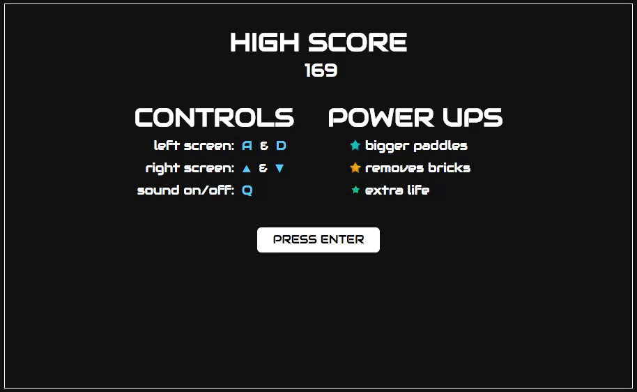

# Breakdown

### Background
Breakdown takes two classic arcade games, 'Pong' and 'Breakout', and combines them into one fun game. The main screen is split into two smaller screens: the left screen contains Breakout, while the right contains Pong. Players must multitask by playing both games at the same time. The game is over when the player's lives run out.

### Functionality
Users are able to:
- [x] Start the game on 'ENTER'
- [x] Move each paddle with its respective keys
- [x] Activate power ups by catching them with the Breakout paddle
- [x] View their score and the global high score after losing
- [x] Toggle sounds on & off using 'Q'

### Gameplay



Breakdown consists of a main menu displaying the global high score, controls, and power up information. After pressing ENTER, users immediately start the game.

The game has two screens: 'Breakout' on the left and 'Pong' on the right. Players control the Breakout paddle with A & D keys, and the Pong paddle with Up & Down arrow keys. Players have 10 lives. Players score 1 point per brick broken and 5 points for every Pong goal scored.

When the Breakout ball hits a brick, there is a small chance that a Power Up will appear. Players must catch the power up with the Breakout paddle in order to activate it.

When the player runs out of lives, they will be returned to the main menu where they can view their score next to the global high score.

### Technologies
HTML, CSS, JavaScript, jQuery, and Google Firebase

### Technical Details

Promises were used to ensure power-ups only last 8 seconds.
```     
increasePaddleSize() {
  new Promise(() => (
    pongPaddle.height = Math.round( pongPaddle.height * 10/7)
  )).then(setTimeout(() => (
    pongPaddle.height = Math.round( pongPaddle.height * 7/10 )
  ), 8000));
}
```

Firebase is used to set & retrieve the global high score.
```
getHighScore(domClass) {
  firebase.database().ref('/highScore').on('value', function(snapshot) {
    this.highScore = snapshot.val();
    $(domClass).append(snapshot.val());
  }.bind(this));
}

setHighScore(score) {
  firebase.database().ref('/').set({
    highScore: score
  });
}
```


### Bonus Features
- [ ] Add ball speed power up
- [ ] Global high score list with names
