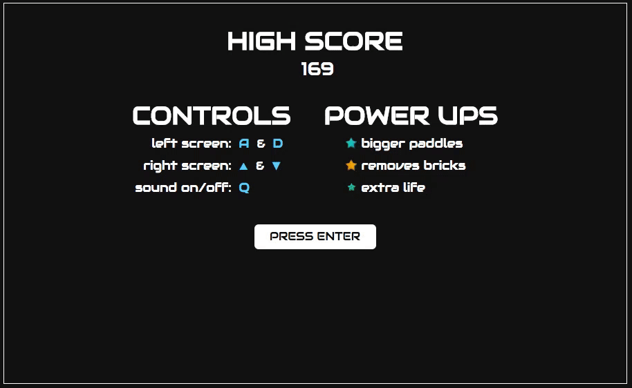

# Breakdown

### Background
Breakdown takes two classic arcade games, 'Pong' and 'Breakout', and combines them into one fun game. The main screen is split into two smaller screens: the left screen contains Breakout, while the right contains Pong. Players must multitask by playing both games at the same time. The game is over when the player's lives run out.

### Functionality
Users are able to:
- [x] Start the game on 'ENTER'
- [x] Move each paddle with its respective keys
- [x] Activate power ups by catching them with the Breakout paddle
- [x] View their score and the global high score after losing
- [x] Toggle sounds on & off using 'Q'

### Gameplay



Breakdown consists of two separate games: 'Breakout' on the left and 'Pong' on the right. Players control the Breakout paddle with A & D keys, and the Pong paddle with Up & Down arrow keys. Players have 10 lives; they can score 1 point per brick broken and 10 points for every Pong goal scored.

When the Breakout ball hits a brick, there is a 1/10 chance that a Power Up will appear. Players must catch the power up with the Breakout paddle in order to activate it on both screens.

When the player runs out of lives, they will be returned to the main menu where they can view their score along with the global high score.

### Technical Details
The HTML5 Canvas API efficiently renders and updates gameplay and animations. Game logic was written in JavaScript and utilizes jQuery to append/remove the main menu, score count, lives count, and high score. All sound effects are played using JavaScript's native `Audio` class, and will not play if the game is muted.

```
playAudio(src) {
  let audio = new Audio(src);
  if (!this.muted) { audio.play(); }
}
```

Google Firebase was used to seamlessly store and retrieve global high score data in the cloud.
```
getHighScore() {
  firebase.database().ref('/highScore').on('value', function(snapshot) {
    this.highScore = snapshot.val();
  }.bind(this));
}

setHighScore(score) {
  firebase.database().ref('/').set({
    highScore: score
  });
}
```


### Bonus Features
- [ ] Add ball speed power up
- [ ] Global high score list with names
